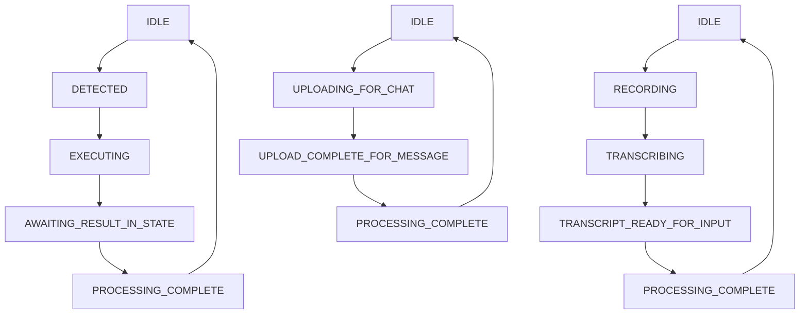

# Client Chat Operation State Machine: Technical Documentation

## 1. Introduction

This document provides a comprehensive technical overview of the Client Chat Operation State Machine, a centralized system for managing asynchronous operations in the chat interface. The state machine tracks AI tool calls, audio transcription, and file uploads, providing consistent UI feedback and preventing conflicting operations.

## 2. System Architecture

### 2.1. Overview

The Client Chat Operation State Machine is built using TypeScript enums and Zustand for state management. It provides a unified way to track three distinct operation types:

- **AI Tool Operations**: Tool calls, execution, and result processing
- **Audio Operations**: Recording, transcription, and input preparation
- **File Upload Operations**: File uploads and message preparation

### 2.2. Core Components

- **`clientChatOperationState.ts`**: Core state definitions, enums, and utility functions
- **`useClientChatOperationStore.ts`**: Zustand store for state management
- **Integration Components**: UI components that consume and update the state

### 2.3. State Machine Design

The state machine uses separate state enums for each operation type, allowing concurrent operations while maintaining clear state transitions:



## 3. State Definitions

### 3.1. AI Tool States

```typescript
export enum AIToolState {
  IDLE = 'AI_TOOL_IDLE',
  DETECTED = 'AI_TOOL_DETECTED',
  EXECUTING = 'AI_TOOL_EXECUTING',
  AWAITING_RESULT_IN_STATE = 'AI_TOOL_AWAITING_RESULT_IN_STATE',
  PROCESSING_COMPLETE = 'AI_TOOL_PROCESSING_COMPLETE'
}
```

**State Descriptions:**
- `IDLE`: No AI tool operation in progress
- `DETECTED`: Tool call has been identified but not yet started
- `EXECUTING`: Tool is currently being executed
- `AWAITING_RESULT_IN_STATE`: Tool execution complete, waiting for result integration
- `PROCESSING_COMPLETE`: Operation finished, ready to return to idle

### 3.2. Audio States

```typescript
export enum AudioState {
  IDLE = 'AUDIO_IDLE',
  RECORDING = 'AUDIO_RECORDING',
  TRANSCRIBING = 'AUDIO_TRANSCRIBING',
  TRANSCRIPT_READY_FOR_INPUT = 'AUDIO_TRANSCRIPT_READY_FOR_INPUT',
  PROCESSING_COMPLETE = 'AUDIO_PROCESSING_COMPLETE'
}
```

**State Descriptions:**
- `IDLE`: No audio operation in progress
- `RECORDING`: Actively recording audio input
- `TRANSCRIBING`: Converting recorded audio to text
- `TRANSCRIPT_READY_FOR_INPUT`: Transcription complete, ready for chat input
- `PROCESSING_COMPLETE`: Audio operation finished

### 3.3. File Upload States

```typescript
export enum FileUploadState {
  IDLE = 'FILE_IDLE',
  UPLOADING_FOR_CHAT = 'FILE_UPLOADING_FOR_CHAT',
  UPLOAD_COMPLETE_FOR_MESSAGE = 'FILE_UPLOAD_COMPLETE_FOR_MESSAGE',
  PROCESSING_COMPLETE = 'FILE_PROCESSING_COMPLETE'
}
```

**State Descriptions:**
- `IDLE`: No file upload in progress
- `UPLOADING_FOR_CHAT`: File is being uploaded for chat message
- `UPLOAD_COMPLETE_FOR_MESSAGE`: Upload complete, preparing for message
- `PROCESSING_COMPLETE`: File upload operation finished

### 3.4. Complete State Type

```typescript
export type ClientChatOperationState = {
  aiToolState: AIToolState;
  audioState: AudioState;
  fileUploadState: FileUploadState;
  currentToolCallId?: string;
  currentOperationDescription?: string;
};
```

## 4. Core Utility Functions

### 4.1. `isAnyOperationInProgress()`

Determines if any operation is currently active:

```typescript
export const isAnyOperationInProgress = (state: ClientChatOperationState): boolean => {
  return (
    state.aiToolState !== AIToolState.IDLE && state.aiToolState !== AIToolState.PROCESSING_COMPLETE ||
    state.audioState !== AudioState.IDLE && state.audioState !== AudioState.PROCESSING_COMPLETE ||
    state.fileUploadState !== FileUploadState.IDLE && state.fileUploadState !== FileUploadState.PROCESSING_COMPLETE
  );
};
```

**Usage Example:**
```typescript
const operationState = useClientChatOperationStore();
const isBusy = isAnyOperationInProgress(operationState);

// Disable input when any operation is in progress
<input disabled={isBusy} />
```

### 4.2. `getOperationStatusText()`

Returns user-friendly status messages with priority handling:

```typescript
export const getOperationStatusText = (state: ClientChatOperationState): string | null => {
  // AI tool operations have highest priority
  if (state.aiToolState === AIToolState.EXECUTING) {
    return `Processing AI action: ${state.currentOperationDescription || 'tool call'}...`;
  }
  if (state.aiToolState === AIToolState.AWAITING_RESULT_IN_STATE) {
    return 'Updating chat with AI tool result...';
  }
  
  // Audio operations have medium priority
  if (state.audioState === AudioState.TRANSCRIBING) {
    return 'Transcribing audio...';
  }
  if (state.audioState === AudioState.TRANSCRIPT_READY_FOR_INPUT) {
    return 'Preparing transcript for chat...';
  }
  
  // File upload operations have lowest priority
  if (state.fileUploadState === FileUploadState.UPLOADING_FOR_CHAT) {
    return 'Uploading file for chat message...';
  }
  if (state.fileUploadState === FileUploadState.UPLOAD_COMPLETE_FOR_MESSAGE) {
    return 'Preparing file for chat message...';
  }
  
  return null;
};
```

**Usage Example:**
```typescript
const operationState = useClientChatOperationStore();
const statusText = getOperationStatusText(operationState);

// Display status in UI
{statusText && (
  <div className="status-indicator">
    {statusText}
  </div>
)}
```

## 5. Zustand Store Integration

### 5.1. Store Interface

```typescript
interface ClientChatOperationStore extends ClientChatOperationState {
  setAIToolState: (aiToolState: AIToolState) => void;
  setAudioState: (audioState: AudioState) => void;
  setFileUploadState: (fileUploadState: FileUploadState) => void;
  setCurrentToolCallId: (toolCallId?: string) => void;
  setCurrentOperationDescription: (description?: string) => void;
  resetChatOperationState: () => void;
  setOperationStates: (states: Partial<ClientChatOperationState>) => void;
}
```

### 5.2. Store Usage

**Basic State Updates:**
```typescript
const operationStore = useClientChatOperationStore();

// Update individual states
operationStore.setAIToolState(AIToolState.EXECUTING);
operationStore.setCurrentOperationDescription('search documents');

// Batch updates
operationStore.setOperationStates({
  aiToolState: AIToolState.EXECUTING,
  currentToolCallId: 'tool-123',
  currentOperationDescription: 'search documents'
});

// Reset all states
operationStore.resetChatOperationState();
```

## 6. Integration Examples

### 6.1. UI Component Integration

**ChatPaneWrapper.tsx** demonstrates proper integration:

```typescript
import { useClientChatOperationStore } from '@/lib/stores/useClientChatOperationStore';
import { isAnyOperationInProgress, getOperationStatusText } from '@/src/lib/clientChatOperationState';

export const ChatPaneWrapper: React.FC<ChatPaneWrapperProps> = ({ ... }) => {
  // Consume the operation state
  const operationState = useClientChatOperationStore();
  const isBusyFromStore = isAnyOperationInProgress(operationState);
  const statusTextFromStore = getOperationStatusText(operationState);

  return (
    <div className="chat-pane">
      <ChatMessagesList
        isChatLoading={isChatLoading || isBusyFromStore}
        // ... other props
      />
      
      {/* Display operation status */}
      {statusTextFromStore && (
        <div className="p-2 text-sm text-center text-[--muted-text-color] bg-[--bg-secondary] border-t border-[--border-color]">
          {statusTextFromStore}
        </div>
      )}
      
      <ChatInputArea
        disabled={isBusyFromStore}
        // ... other props
      />
    </div>
  );
};
```

### 6.2. State Transition Management

**useChatInteractions.ts** shows how to manage state transitions:

```typescript
import { useClientChatOperationStore } from '@/lib/stores/useClientChatOperationStore';
import { AIToolState, AudioState, FileUploadState } from '@/src/lib/clientChatOperationState';

export function useChatInteractions({ ... }) {
  const operationStore = useClientChatOperationStore();

  // AI Tool Call Flow
  const handleToolCall = async (toolCall: any) => {
    try {
      // 1. Detect tool call
      operationStore.setOperationStates({
        aiToolState: AIToolState.DETECTED,
        currentToolCallId: toolCall.id
      });

      // 2. Start execution
      operationStore.setOperationStates({
        aiToolState: AIToolState.EXECUTING,
        currentOperationDescription: toolCall.function.name
      });

      // 3. Execute tool
      const result = await executeToolCall(toolCall);

      // 4. Await result integration
      operationStore.setAIToolState(AIToolState.AWAITING_RESULT_IN_STATE);

      // 5. Complete processing
      await integrateResult(result);
      operationStore.setAIToolState(AIToolState.PROCESSING_COMPLETE);

      // 6. Reset to idle
      operationStore.resetChatOperationState();
    } catch (error) {
      // Reset on error
      operationStore.resetChatOperationState();
      throw error;
    }
  };

  // Audio Recording Flow
  const handleAudioRecording = async () => {
    try {
      // Start recording
      operationStore.setAudioState(AudioState.RECORDING);
      
      // ... recording logic ...
      
      // Start transcription
      operationStore.setAudioState(AudioState.TRANSCRIBING);
      const transcript = await transcribeAudio(audioData);
      
      // Prepare for input
      operationStore.setAudioState(AudioState.TRANSCRIPT_READY_FOR_INPUT);
      
      // Complete
      operationStore.setAudioState(AudioState.PROCESSING_COMPLETE);
      operationStore.resetChatOperationState();
    } catch (error) {
      operationStore.resetChatOperationState();
      throw error;
    }
  };

  return {
    handleToolCall,
    handleAudioRecording,
    // ... other functions
  };
}
```

## 7. Best Practices

### 7.1. Error Handling

Always reset state on errors to prevent stuck states:

```typescript
const handleOperation = async () => {
  try {
    operationStore.setAIToolState(AIToolState.EXECUTING);
    await performOperation();
    operationStore.setAIToolState(AIToolState.PROCESSING_COMPLETE);
  } catch (error) {
    // Always reset on error
    operationStore.resetChatOperationState();
    throw error;
  }
};
```

### 7.2. Concurrent Operations

The state machine supports concurrent operations. Each operation type is independent:

```typescript
// These can run simultaneously
operationStore.setAIToolState(AIToolState.EXECUTING);
operationStore.setAudioState(AudioState.TRANSCRIBING);
operationStore.setFileUploadState(FileUploadState.UPLOADING_FOR_CHAT);
```

### 7.3. UI Responsiveness

Use the utility functions to provide appropriate UI feedback:

```typescript
const operationState = useClientChatOperationStore();
const isBusy = isAnyOperationInProgress(operationState);
const statusText = getOperationStatusText(operationState);

// Disable inputs during operations
const isInputDisabled = isBusy;

// Show loading indicators
const showSpinner = isBusy;

// Display status messages
const showStatus = !!statusText;
```

## 8. Testing

### 8.1. Unit Tests

Comprehensive unit tests are available in:
- `src/lib/__tests__/clientChatOperationState.test.ts` - Core utility functions
- `lib/stores/__tests__/useClientChatOperationStore.test.ts` - Zustand store

**Running Tests:**
```bash
npm test -- --testPathPattern="clientChatOperationState|useClientChatOperationStore"
```

### 8.2. Test Coverage

The test suite covers:
- All enum values and type definitions
- State transition logic for all operation types
- Utility function correctness with various state combinations
- Store behavior including initialization, updates, and reset
- Concurrent operation handling
- Error scenarios and edge cases

**Test Results:** 50 tests passing with comprehensive coverage of all functionality.

## 9. Troubleshooting

### 9.1. Common Issues

**Issue: UI stuck in loading state**
- **Cause**: State not properly reset after error
- **Solution**: Ensure `resetChatOperationState()` is called in error handlers

**Issue: Status text not updating**
- **Cause**: Component not subscribed to store updates
- **Solution**: Verify `useClientChatOperationStore()` is called in component

**Issue: Multiple operations conflicting**
- **Cause**: Improper state management
- **Solution**: Use `isAnyOperationInProgress()` to check before starting new operations

### 9.2. Debugging

**Check Current State:**
```typescript
const operationState = useClientChatOperationStore();
console.log('Current state:', operationState);
console.log('Is busy:', isAnyOperationInProgress(operationState));
console.log('Status text:', getOperationStatusText(operationState));
```

**Monitor State Changes:**
```typescript
useEffect(() => {
  const unsubscribe = useClientChatOperationStore.subscribe(
    (state) => console.log('State changed:', state)
  );
  return unsubscribe;
}, []);
```

### 9.3. Performance Considerations

- The state machine is lightweight and optimized for frequent updates
- Zustand provides efficient re-rendering only for subscribed components
- State transitions are synchronous and don't block the UI thread
- Use `setOperationStates()` for batch updates to minimize re-renders

## 10. Future Extensions

### 10.1. Adding New Operation Types

To add a new operation type:

1. **Define the enum:**
```typescript
export enum NewOperationState {
  IDLE = 'NEW_OPERATION_IDLE',
  PROCESSING = 'NEW_OPERATION_PROCESSING',
  COMPLETE = 'NEW_OPERATION_COMPLETE'
}
```

2. **Update the state type:**
```typescript
export type ClientChatOperationState = {
  // ... existing states
  newOperationState: NewOperationState;
};
```

3. **Update utility functions:**
```typescript
export const isAnyOperationInProgress = (state: ClientChatOperationState): boolean => {
  return (
    // ... existing checks
    state.newOperationState !== NewOperationState.IDLE && 
    state.newOperationState !== NewOperationState.COMPLETE
  );
};
```

4. **Update the store interface and implementation**

5. **Add comprehensive tests**

### 10.2. Enhanced Status Messages

Consider adding more granular status messages or internationalization support for better user experience.

---

This documentation provides a complete reference for understanding, implementing, and maintaining the Client Chat Operation State Machine. For additional examples and implementation details, refer to the comprehensive test suite and existing component integrations. 