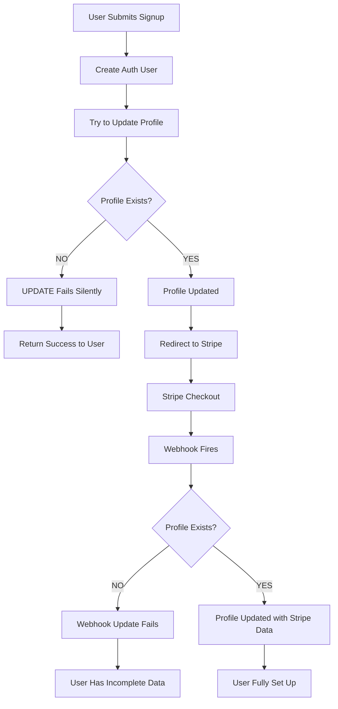

# Fix Signup Flow - Missing Profile Data

## Problem Statement

Users are able to sign up successfully, but critical data is missing from the `profiles` table, resulting in incomplete user records.

### Data Status

**Columns with data:**
- `id` (user ID from auth.users)
- `email` 
- `billing_cycle`

**Columns missing data:**
- `updated_at`
- `stripe_customer_id`
- `stripe_subscription_id` 
- `stripe_subscription_status`

## Root Cause Analysis

### 1. ~~Missing Database Trigger~~ ✅ Profiles Being Created Successfully

~~The biggest issue is that there's **no `handle_new_user` database trigger** to automatically create profile records when users sign up.~~

**UPDATE:** Profiles are being created successfully. Users can sign up, complete payment, and appear in Stripe Dashboard. The issue is with **webhook data synchronization**.

### 2. Webhook Processing Failures

The primary issue is that Stripe webhooks are not properly updating profile records with Stripe data. Several potential failure points:

#### 2.1 User ID Mapping Issues
The webhook relies on `client_reference_id` to map Stripe events back to users:

```typescript
userId = session.client_reference_id; // Passed during checkout session creation

if (!userId) {
  console.error('Webhook Error (checkout.session.completed): Missing client_reference_id (userId).');
  return NextResponse.json({ received: true, error: 'Missing client_reference_id' }, { status: 200 }); // Ack to Stripe
}
```

**Problem:** If `client_reference_id` isn't set correctly during checkout session creation, webhooks can't identify which user to update.

#### 2.2 Silent Webhook Failures
Current webhook error handling may be too permissive:

```typescript
dbError = await updateUserProfile(supabase, userId, profileData);
if (dbError) return NextResponse.json({ received: true, error: 'Database update failed after checkout.' }, { status: 500 });
```

**Problem:** Errors may be logged but not properly surfaced, and webhook retries might not happen as expected.

#### 2.3 Async Subscription Creation
Stripe subscriptions may not be immediately available in the checkout session:

```typescript
if (!stripeSubscriptionIdFromSession) {
  console.error(`Webhook Error (checkout.session.completed) for user ${userId}: Missing Stripe Subscription ID on session.`);
  // Attempts fallback but may still fail
}
```

**Problem:** Race condition where checkout completes before subscription is fully created in Stripe.

### 3. Data Inconsistency Patterns

Since users exist in both profiles and Stripe, but are missing connection data, the issue is likely:

1. **Webhooks not firing** (webhook endpoint configuration issue)
2. **Webhooks firing but failing** (database/permission issues)  
3. **Webhooks succeeding but with wrong data** (mapping/payload issues)
4. **Timing issues** (subscription data not ready when webhook fires)

## Current Flow Gaps



## Proposed Solution

### Phase 1: Debug & Fix Webhook Processing (Immediate)

#### 1.1 ~~Create Database Trigger~~ - Not Needed
~~Create a Postgres trigger to automatically create profile records~~

**Profiles are already being created successfully. Skip this step.**

#### 1.2 Webhook Debugging & Logging
Add comprehensive logging to understand where webhooks are failing:

```typescript
// Enhanced webhook logging in app/api/stripe/webhook/route.ts
export async function POST(request: NextRequest) {
  console.log(`🔍 WEBHOOK DEBUG: Received ${event.type}, Event ID: ${event.id}`);
  console.log(`🔍 WEBHOOK DEBUG: Full payload:`, JSON.stringify(event, null, 2));
  
  switch (event.type) {
    case 'checkout.session.completed':
      const session = event.data.object as Stripe.Checkout.Session;
      
      // Log all critical fields
      console.log(`🔍 CHECKOUT DEBUG: Session ID: ${session.id}`);
      console.log(`🔍 CHECKOUT DEBUG: Client Reference ID: ${session.client_reference_id}`);
      console.log(`🔍 CHECKOUT DEBUG: Customer: ${session.customer}`);
      console.log(`🔍 CHECKOUT DEBUG: Subscription: ${session.subscription}`);
      
      userId = session.client_reference_id;
      
      if (!userId) {
        console.error(`❌ CRITICAL: Missing client_reference_id in session ${session.id}`);
        // ... rest of error handling
      }
```

#### 1.3 Verify Webhook Configuration
Check if webhooks are properly configured and firing:

1. **Webhook Endpoint URL**: Verify `https://yourapp.com/api/stripe/webhook` is accessible
2. **Webhook Events**: Ensure these events are enabled in Stripe Dashboard:
   - `checkout.session.completed`
   - `customer.subscription.updated`
   - `customer.subscription.deleted`
   - `invoice.payment_succeeded`
   - `invoice.payment_failed`

#### 1.4 Fix Client Reference ID Setting
Ensure user ID is properly passed to Stripe checkout:

```typescript
// In app/api/stripe/create-checkout-session/route.ts
const sessionParams: Stripe.Checkout.SessionCreateParams = {
  // ... other params
  client_reference_id: userId, // This MUST be set for webhooks to work
  
  // Also add to subscription metadata as backup
  subscription_data: {
    trial_period_days: 7,
    metadata: { 
      app_user_id: userId,
      app_user_email: email // Add email as backup identifier
    }
  },
  
  // Add to customer metadata too
  customer_update: {
    metadata: {
      app_user_id: userId,
      app_user_email: email
    }
  }
};

console.log(`🔍 CHECKOUT SESSION DEBUG: Creating session with client_reference_id: ${userId}`);
```

#### 1.5 Add Webhook Fallback User Identification
Enhance webhook to find users by multiple methods:

```typescript
async function findUserIdFromStripeData(supabase: SupabaseClient, session: Stripe.Checkout.Session): Promise<string | null> {
  // Method 1: Direct client_reference_id
  if (session.client_reference_id) {
    console.log(`🔍 Found userId via client_reference_id: ${session.client_reference_id}`);
    return session.client_reference_id;
  }
  
  // Method 2: Customer metadata
  if (session.customer) {
    const customerId = typeof session.customer === 'string' ? session.customer : session.customer.id;
    const customer = await stripe.customers.retrieve(customerId);
    if (customer.metadata?.app_user_id) {
      console.log(`🔍 Found userId via customer metadata: ${customer.metadata.app_user_id}`);
      return customer.metadata.app_user_id;
    }
  }
  
  // Method 3: Database lookup by customer email
  if (session.customer_email) {
    const { data, error } = await supabase
      .from('profiles')
      .select('id')
      .eq('email', session.customer_email)
      .single();
      
    if (data && !error) {
      console.log(`🔍 Found userId via email lookup: ${data.id}`);
      return data.id;
    }
  }
  
  console.error(`❌ Could not find userId for session ${session.id}`);
  return null;
}
```

### Phase 2: Backfill Existing Users

#### 2.1 Identify Affected Users
Create a script to find users with missing profile data:

```sql
-- Find auth users without profiles
SELECT u.id, u.email, u.created_at
FROM auth.users u
LEFT JOIN public.profiles p ON u.id = p.id
WHERE p.id IS NULL;

-- Find profiles missing Stripe data
SELECT id, email, billing_cycle, stripe_customer_id, stripe_subscription_id, stripe_subscription_status
FROM public.profiles
WHERE stripe_customer_id IS NULL 
   OR stripe_subscription_id IS NULL 
   OR stripe_subscription_status IS NULL;
```

#### 2.2 Backfill Script
Create `scripts/backfill-profiles.js`:

```javascript
async function backfillMissingProfiles() {
  // 1. Create missing profile records
  // 2. Query Stripe for customer/subscription data
  // 3. Update profiles with Stripe data
  // 4. Set appropriate subscription status
}
```

#### 2.3 Stripe Data Recovery
For users with missing Stripe data:

1. **Find Stripe Customers by Email**
   ```javascript
   const customers = await stripe.customers.list({ email: userEmail });
   ```

2. **Find Subscriptions by Customer**
   ```javascript
   const subscriptions = await stripe.subscriptions.list({ customer: customerId });
   ```

3. **Update Profile Records**
   ```javascript
   await supabase.from('profiles').update({
     stripe_customer_id: customer.id,
     stripe_subscription_id: subscription.id,
     stripe_subscription_status: subscription.status,
     updated_at: new Date().toISOString()
   }).eq('id', userId);
   ```

### Phase 3: Monitoring & Prevention

#### 3.1 Health Checks
Add monitoring to detect signup flow issues:

```typescript
// Add to signup endpoint
if (profileError) {
  // Log critical error
  console.error(`CRITICAL: Profile creation failed for user ${authData.user.id}`);
  
  // Could add to error tracking service
  // Sentry.captureException(new Error(`Profile creation failed: ${profileError.message}`));
  
  // Return error to prevent incomplete signups
  return NextResponse.json({
    error: `Signup incomplete: ${profileError.message}`,
    userId: authData.user.id,
  }, { status: 500 });
}
```

#### 3.2 Webhook Monitoring
Add alerting for webhook failures:

```typescript
if (dbError) {
  console.error(`WEBHOOK ERROR: Profile update failed for user ${userId}:`, dbError);
  // Alert monitoring system
  return NextResponse.json({ 
    received: true, 
    error: 'Profile update failed' 
  }, { status: 500 });
}
```

#### 3.3 Data Validation
Regular automated checks for data integrity:

```sql
-- Check for profiles missing critical data
SELECT 
  COUNT(*) as total_profiles,
  COUNT(stripe_customer_id) as with_customer_id,
  COUNT(stripe_subscription_id) as with_subscription_id,
  COUNT(stripe_subscription_status) as with_status
FROM public.profiles;
```

## Implementation Priority

### High Priority (Fix Now)
1. ✅ ~~Create database trigger for automatic profile creation~~ - Not needed, profiles exist
2. ✅ Add comprehensive webhook debugging and logging
3. ✅ Verify webhook endpoint configuration in Stripe Dashboard  
4. ✅ Fix client_reference_id setting in checkout session creation
5. ✅ Add fallback user identification methods in webhooks

### Medium Priority (Next Sprint)
1. Create diagnostic script to identify affected users and their Stripe status
2. Implement Stripe data recovery for existing users
3. Add webhook retry mechanisms for failed updates
4. Create health check endpoints for webhook monitoring

### Low Priority (Future)
1. Add automated data integrity checks
2. Implement retry mechanisms for failed webhooks
3. Create admin dashboard for monitoring signup health

## Testing Strategy

### Unit Tests
- Test profile creation trigger
- Test UPSERT operations
- Test webhook profile creation

### Integration Tests  
- End-to-end signup flow
- Webhook processing with missing profiles
- Backfill script accuracy

### Manual Testing
- Complete signup flow in staging
- Simulate webhook failures
- Verify backfill script results

## Success Metrics

### Before Fix
- Users with incomplete profiles: ~X%
- Webhook failure rate: ~Y%
- Support tickets related to billing: Z/week

### After Fix
- Users with incomplete profiles: <1%
- Webhook failure rate: <0.5%
- Support tickets related to billing: <1/week

## Rollout Plan

### Week 1: Foundation
- Deploy database trigger
- Update signup flow
- Deploy enhanced webhooks

### Week 2: Recovery  
- Run backfill script
- Verify data integrity
- Monitor for issues

### Week 3: Monitoring
- Deploy monitoring
- Add alerting
- Document processes

## Risk Mitigation

### Database Changes
- Test trigger in staging first
- Use try/catch in trigger function
- Monitor for performance impact

### Backfill Operations
- Run on small batches first
- Verify data before mass updates
- Have rollback plan ready

### Webhook Changes
- Maintain backward compatibility
- Monitor Stripe webhook logs
- Test failure scenarios

## Conclusion

This fix addresses the root cause (missing database trigger) while providing comprehensive recovery and prevention measures. The phased approach ensures we can fix immediate issues while building robust long-term solutions.

The key insight is that the current code assumes infrastructure that doesn't exist (the `handle_new_user` trigger). By implementing this missing piece and adding proper error handling, we can ensure all future signups work correctly while recovering data for existing affected users. 